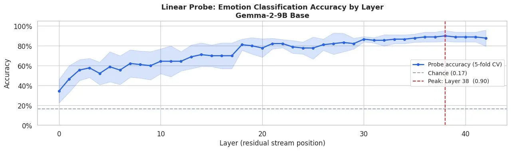
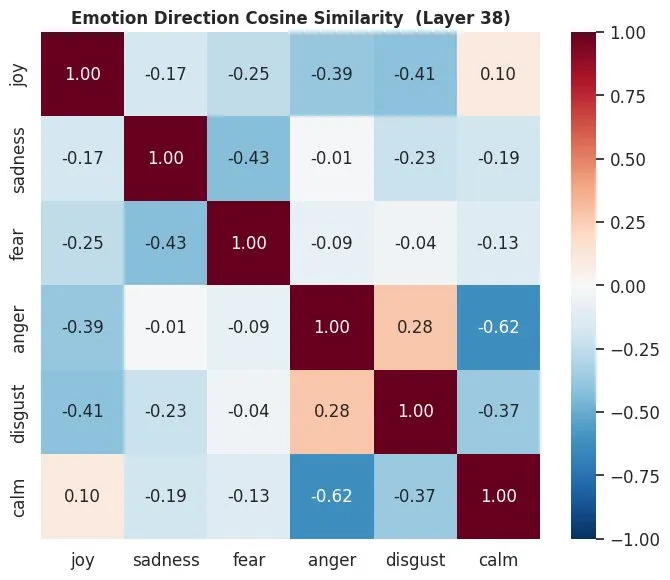
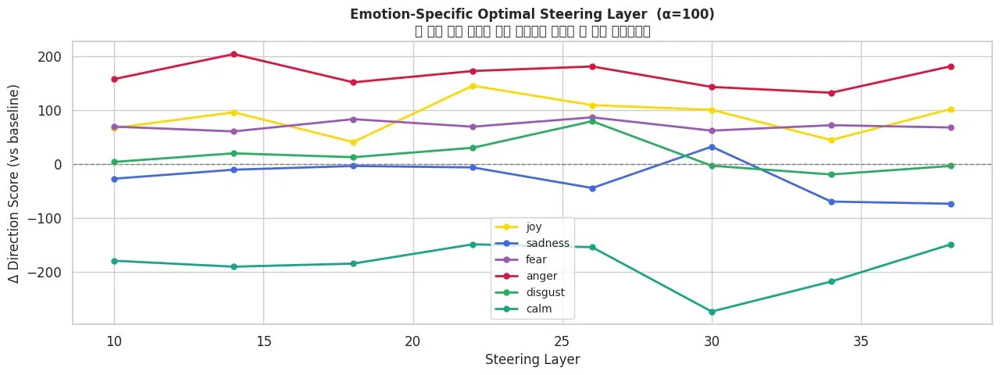
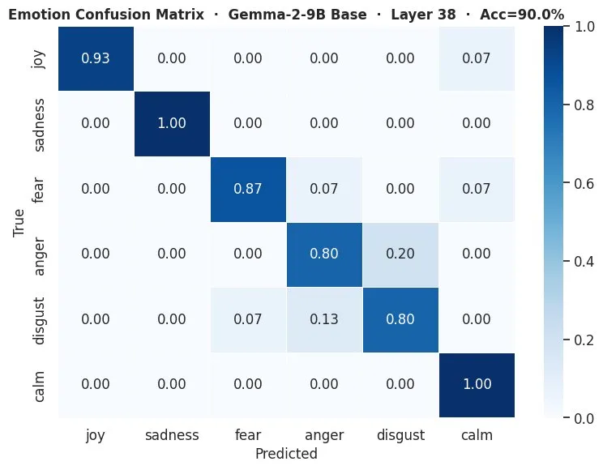
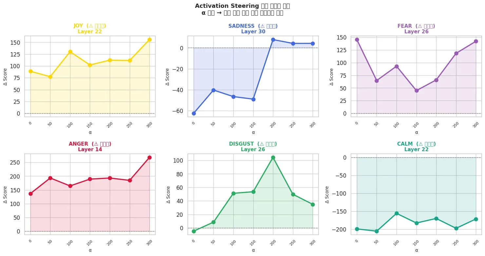
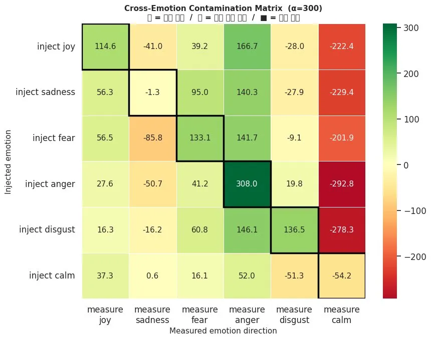
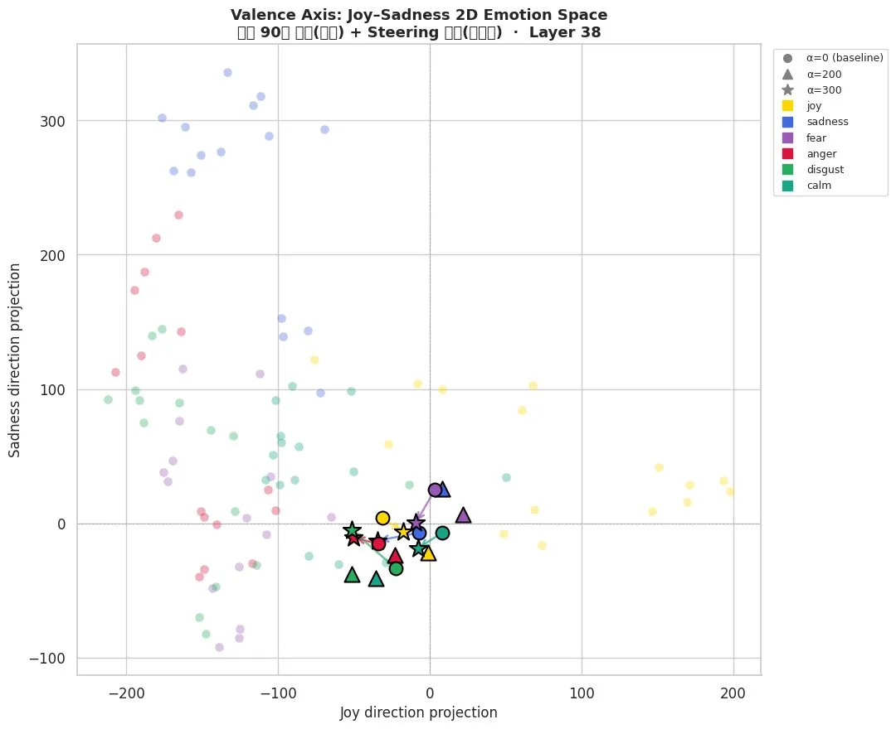

# Emotion Concepts in Gemma-2-9B (Base) — Activation Steering Experiment

> Extracting emotion direction vectors from the internal representation space of an LLM and controlling the sentiment of generated text via Activation Steering.

**Model:** `google/gemma-2-9b` (4-bit NF4 quantization via bitsandbytes)  
**Emotion Classes:** `joy` · `sadness` · `fear` · `anger` · `disgust` · `calm`

---

## Table of Contents

- [Overview](#overview)
- [Methodology](#methodology)
  - [1. Implicit Emotion Prompts](#1-implicit-emotion-prompts)
  - [2. Hidden State Extraction](#2-hidden-state-extraction)
  - [3. Linear Probe — Optimal Layer Search](#3-linear-probe--optimal-layer-search)
  - [4. Direction Vector Extraction (DIM)](#4-direction-vector-extraction-dim)
  - [5. Steering Layer Scan](#5-steering-layer-scan)
  - [6. Activation Steering](#6-activation-steering)
- [Results](#results)
  - [Probe Accuracy](#probe-accuracy)
  - [Direction Vector Polarity](#direction-vector-polarity)
  - [Optimal Steering Layers](#optimal-steering-layers)
  - [Steering Text Examples](#steering-text-examples)
- [Figures](#figures)
- [Failed Improvements (Refactored v2)](#failed-improvements-refactored-v2)
- [Key Insights](#key-insights)
- [File Structure](#file-structure)
- [Environment](#environment)
- [Quick Start](#quick-start)
- [한국어 (Korean)](#한국어-korean)

---

## Overview

This project investigates whether a base (non-instruction-tuned) language model internally encodes distinguishable **emotion concepts**, and whether those concepts can be leveraged to **steer generation** toward specific emotional tones.

We extract emotion direction vectors from Gemma-2-9B's residual stream using the **Difference-in-Means (DIM)** method, validate them with linear probing (90% accuracy, 6 classes), and apply **Activation Steering** at inference time to modulate generated text sentiment—without any fine-tuning or prompt engineering.

---

## Methodology

### 1. Implicit Emotion Prompts

We deliberately avoid explicit emotion words, instead using situational descriptions that **implicitly** evoke emotions:

```
# ✗ Explicit (bad)
"I feel joy because I succeeded."

# ✓ Implicit (good)
"The finish line tape broke across my chest and I kept running anyway."
```

**6 emotions × 15 prompts = 90 total prompts**

### 2. Hidden State Extraction

Each prompt is tokenized → forward pass → hidden states from **all layers** are extracted.

- Shape: `(90, 43, 3584)` — (samples, layers, hidden_dim)
- We use the **last token** representation as it compresses the entire sequence context in Gemma-family models.

### 3. Linear Probe — Optimal Layer Search

For each layer, we fit `StandardScaler` + `LogisticRegression` with 5-fold stratified CV.

| Metric | Value |
|--------|-------|
| **Best Layer** | 38 |
| **Peak Accuracy** | 90.0% |
| **Chance Level** | 16.7% |



### 4. Direction Vector Extraction (DIM)

```python
global_mean = mean(all_samples)
direction[emo] = mean(samples[emo]) - global_mean
direction[emo] = direction[emo] / ||direction[emo]||   # L2 normalize
```

Polarity is verified and automatically flipped if the direction points the wrong way.



### 5. Steering Layer Scan

Each emotion's direction vector is injected at different layers to find the **layer producing the maximum Δ score** for that emotion.



### 6. Activation Steering

At inference time, we register a forward hook to additively inject the direction vector:

```python
def hook_fn(module, inp, output):
    return output + alpha * direction_tensor

model.layers[steer_layer].register_forward_hook(hook_fn)
```

---

## Results

### Probe Accuracy

| Emotion | Precision | Recall | F1-Score |
|---------|-----------|--------|----------|
| joy | 0.80 | 0.80 | 0.80 |
| sadness | 0.88 | 1.00 | 0.94 |
| fear | 0.80 | 0.80 | 0.80 |
| anger | 0.93 | 0.87 | 0.90 |
| disgust | 1.00 | 0.93 | 0.97 |
| calm | 1.00 | 1.00 | 1.00 |
| **macro avg** | **0.90** | **0.90** | **0.90** |



### Direction Vector Polarity

| Emotion | Self Mean | Other Mean | Status |
|---------|-----------|------------|--------|
| joy | 83.03 | −127.90 | ✅ Forward |
| sadness | 250.02 | +43.18 | ✅ Forward (note) |
| fear | 125.55 | −71.14 | ✅ Forward |
| anger | 134.29 | −64.50 | ✅ Forward |
| disgust | 169.07 | −4.21 | ✅ Forward |
| calm | 249.72 | +17.18 | ✅ Forward (note) |

> **Note:** `sadness` and `calm` show positive other-mean values, suggesting their direction vectors partially overlap with a shared "emotional intensity" axis.

### Optimal Steering Layers

| Emotion | Layer | Δ Score | Interpretation |
|---------|-------|---------|----------------|
| anger | 14 | +203.3 | Primitive/immediate → shallow layer |
| joy | 22 | +144.7 | |
| calm | 22 | −149.5 | Operates via suppression mechanism |
| fear | 26 | +86.0 | |
| disgust | 26 | +78.8 | |
| sadness | 30 | +31.6 | Context-dependent → deep layer |

> **calm** has a negative Δ, meaning calm steering works by **suppressing** other activations rather than amplifying its own.

### Steering Text Examples

**Prompt:** *"I opened the door and stepped outside. I"*

| Emotion | α=0 (base) | α=100 | α=200 |
|---------|-----------|-------|-------|
| **joy** | could hear the voices of children... | was greeted by my husband and son... | was so excited that I couldn't contain myself... |
| **calm** | could feel the blood trickling... | breathed in the fresh air and looked up... | was in the present. The air was still... |
| **disgust** | looked down the road... | was greeted by the smell of rotting food... | heard something in the stomach... |
| **anger** | was not yet ready... | was greeted by a man in a suit... | called the police and said that the police and said... *(repetition loop)* |

> ⚠️ `anger` at α=200 enters a repetition loop → **α=100 is the practical upper bound**.







---

## Figures

| Figure | Description |
|--------|-------------|
| `fig1_probe_curve` | Layer-by-layer probe accuracy (5-fold CV) |
| `fig2_direction_similarity` | Cosine similarity between emotion direction vectors |
| `fig3_confusion_matrix` | Confusion matrix of the linear probe at best layer |
| `fig4_layer_scan` | Steering effectiveness by injection layer |
| `fig5_monotonicity` | α monotonicity check — causal validity |
| `fig6_cross_contamination` | Cross-emotion contamination matrix (α=300) |
| `fig7_valence_axis` | Joy–Sadness 2D emotion space with steering trajectories |

---

## Failed Improvements (Refactored v2)

We attempted five improvements over the original pipeline. All degraded performance.

### ① Token Skip (skip first 10 tokens + average)

- **Intent:** Exclude background tokens, capture pure emotion signal
- **Result:** Accuracy 90% → 64.4%
- **Reason:** In Gemma-family models, the last token compresses the full sequence. Averaging dilutes information.

### ② PCA Orthogonalization (remove confounds via neutral corpus)

- **Intent:** Remove top PCA components (50% variance) of 30 neutral sentences from emotion vectors
- **Result:** Minimal cosine change (0.94–0.99) but accuracy dropped drastically
- **Reason:** The "noise" components actually contained discriminative emotion information. In Gemma-2-9B, emotion expression and grammatical structure **share the same subspace**.

### ③ Norm-aware Alpha (automatic alpha calculation)

- **Intent:** Compute alpha from hidden state norm (576) → base=288
- **Result:** Text completely collapsed at α=576 (*"With in a into! and with yes Yes In!"*)
- **Reason:** Computed alpha exceeded the collapse threshold. The original α=200 was already optimal.

### ④ Valence-Arousal 2D Steering

- **Intent:** Decompose calm as high valence (joy direction) + low arousal (anti-high-arousal)
- **Result:** Δcalm=+16.1 — negligible compared to direct steering
- **Reason:** Calm is encoded as an **independent direction**, not the opposite end of anger/fear on an arousal axis.

### ⑤ Negative Anger Steering (calm via anger suppression)

- **Intent:** cos(−anger, calm) = 0.624 → suppress anger to induce calm
- **Result:** Δcalm consistently negative (−167 to −252) across all layers and alpha values
- **Reason:** Cosine similarity in probe space ≠ generation dynamics in the residual stream. Surface-level calm text was generated but internal emotion vectors moved **away** from calm.

### Performance Comparison

| Metric | v1 (Original) | v2 (Refactored) |
|--------|---------------|-----------------|
| Accuracy | 90.0% | 64.4% |
| calm F1 | 1.00 | 0.35 |
| joy F1 | 0.80 | 0.61 |
| anger F1 | 0.90 | 0.54 |
| Text collapse α | >200 | >288 (actually lower) |

---

## Key Insights

1. **Simplicity wins** — DIM + last token + direct steering dominated all complex improvements.
2. **Calm is an independent axis** — It cannot be reached by negating anger or reducing arousal. It has a unique direction vector.
3. **Anger is shallow, sadness is deep** — The cognitive complexity of an emotion correlates with its optimal steering layer depth.
4. **Probe space ≠ generation space** — High vector similarity does not guarantee matching generation dynamics.
5. **Last token > average** — In Gemma-family models, the last token compresses the entire sequence.

---

## File Structure

```
├── README.md                   # This document
├── emotion_steering.py         # Main experiment code (recommended)
└── figures/
    ├── fig1_probe_curve.webp           # Probe accuracy by layer
    ├── fig2_direction_similarity.webp  # Direction cosine similarity
    ├── fig3_confusion_matrix.webp      # Confusion matrix
    ├── fig4_layer_scan.webp            # Optimal steering layer scan
    ├── fig5_monotonicity.webp          # Alpha monotonicity check
    ├── fig6_cross_contamination.webp   # Cross-emotion contamination
    └── fig7_valence_axis.webp          # Valence-Arousal 2D space
```

---

## Environment

- **GPU:** VRAM ≥ 8 GB recommended
- **Model:** `google/gemma-2-9b` (4-bit NF4, bitsandbytes)
- **Key Libraries:** `transformers` · `torch` · `scikit-learn` · `numpy` · `seaborn` · `matplotlib` · `bitsandbytes` · `accelerate`

---

## Quick Start

```bash
# Clone the repository
git clone https://github.com/syusjko/goggle-gemma-2-9b-Emotion-extracting.git
cd goggle-gemma-2-9b-Emotion-extracting

# Install dependencies
pip install numpy>=2.0 transformers>=4.47.0 bitsandbytes>=0.44.0 accelerate>=0.34.0 \
            scikit-learn umap-learn matplotlib seaborn tqdm

# Run the experiment (requires HF token with Gemma access)
python emotion_steering.py
```

> **Note:** You need a Hugging Face access token with permission for `google/gemma-2-9b`. Get one at [huggingface.co/settings/tokens](https://huggingface.co/settings/tokens).

---

---

# 한국어 (Korean)

# Gemma-2-9B (Base)의 감정 개념 — Activation Steering 실험

> LLM 내부 표현 공간에서 감정 방향벡터를 추출하고, Activation Steering으로 생성 텍스트의 감정을 제어합니다.

**모델:** `google/gemma-2-9b` (4-bit NF4 양자화, bitsandbytes)  
**감정 클래스:** `joy` · `sadness` · `fear` · `anger` · `disgust` · `calm`

---

## 목차

- [개요](#개요)
- [방법론](#방법론)
  - [1. 암시적 감정 프롬프트](#1-암시적-감정-프롬프트)
  - [2. Hidden State 추출](#2-hidden-state-추출)
  - [3. Linear Probe — 최적 레이어 탐색](#3-linear-probe--최적-레이어-탐색)
  - [4. 방향벡터 추출 (DIM)](#4-방향벡터-추출-dim)
  - [5. Steering 레이어 스캔](#5-steering-레이어-스캔)
  - [6. Activation Steering](#6-activation-steering)
- [실험 결과](#실험-결과)
  - [Probe 정확도](#probe-정확도)
  - [방향벡터 극성](#방향벡터-극성)
  - [최적 Steering 레이어](#최적-steering-레이어)
  - [Steering 텍스트 예시](#steering-텍스트-예시)
- [시각화 결과](#시각화-결과)
- [실패한 개선 시도 (Refactored v2)](#실패한-개선-시도-refactored-v2)
- [핵심 인사이트](#핵심-인사이트)
- [파일 구성](#파일-구성)
- [실행 환경](#실행-환경)
- [빠른 시작](#빠른-시작)

---

## 개요

본 프로젝트는 베이스 (비-인스트럭션 튜닝) 언어 모델이 내부적으로 구분 가능한 **감정 개념**을 인코딩하는지 조사하고, 이를 활용하여 **생성 시 특정 감정 톤으로 유도**할 수 있는지 실험합니다.

Gemma-2-9B의 잔차 스트림에서 **Difference-in-Means (DIM)** 방법으로 감정 방향벡터를 추출하고, Linear Probing으로 검증한 후 (90% 정확도, 6개 클래스), 추론 시 **Activation Steering**을 적용하여 파인튜닝이나 프롬프트 엔지니어링 없이 생성 텍스트의 감정을 조절합니다.

---

## 방법론

### 1. 암시적 감정 프롬프트

감정 단어를 직접 사용하지 않고, 감정을 **암시하는 상황/행동** 묘사를 사용합니다:

```
# ✗ 명시적 (나쁜 예)
"I feel joy because I succeeded."

# ✓ 암시적 (좋은 예)
"The finish line tape broke across my chest and I kept running anyway."
```

**6개 감정 × 15문장 = 총 90개 프롬프트**

### 2. Hidden State 추출

각 프롬프트를 토크나이징 후 forward pass → **전체 레이어**의 hidden state를 추출합니다.

- Shape: `(90, 43, 3584)` — (샘플 수, 레이어 수, hidden 차원)
- Gemma 계열에서 **last token**은 시퀀스 전체 맥락을 압축하는 역할을 하므로, last token을 사용합니다.

### 3. Linear Probe — 최적 레이어 탐색

각 레이어에서 `StandardScaler` + `LogisticRegression` (5-fold 층화 CV)을 수행합니다.

| 지표 | 값 |
|------|-----|
| **최적 레이어** | 38 |
| **최고 정확도** | 90.0% |
| **우연 수준** | 16.7% |


### 4. 방향벡터 추출 (DIM)

```python
global_mean = 전체 샘플 평균
direction[emo] = mean(acts[emo]) - global_mean
direction[emo] = direction[emo] / ||direction[emo]||   # L2 정규화
```

극성 검증 후 역방향이면 자동으로 flip합니다.


### 5. Steering 레이어 스캔

각 감정의 방향벡터를 레이어별로 주입하고, 해당 감정에 대한 **Δ score가 최대인 레이어**를 선정합니다.


### 6. Activation Steering

추론 시 forward hook을 등록하여 방향벡터를 가산 주입합니다:

```python
def hook_fn(module, inp, output):
    return output + alpha * direction_tensor

model.layers[steer_layer].register_forward_hook(hook_fn)
```

---

## 실험 결과

### Probe 정확도

| 감정 | Precision | Recall | F1-Score |
|------|-----------|--------|----------|
| joy | 0.80 | 0.80 | 0.80 |
| sadness | 0.88 | 1.00 | 0.94 |
| fear | 0.80 | 0.80 | 0.80 |
| anger | 0.93 | 0.87 | 0.90 |
| disgust | 1.00 | 0.93 | 0.97 |
| calm | 1.00 | 1.00 | 1.00 |
| **macro avg** | **0.90** | **0.90** | **0.90** |


### 방향벡터 극성

| 감정 | 자기 평균 | 타 감정 평균 | 상태 |
|------|----------|------------|------|
| joy | 83.03 | −127.90 | ✅ 정방향 |
| sadness | 250.02 | +43.18 | ✅ 정방향 (주의) |
| fear | 125.55 | −71.14 | ✅ 정방향 |
| anger | 134.29 | −64.50 | ✅ 정방향 |
| disgust | 169.07 | −4.21 | ✅ 정방향 |
| calm | 249.72 | +17.18 | ✅ 정방향 (주의) |

> **참고:** `sadness`와 `calm`은 타 감정 평균이 양수입니다. 이 두 방향벡터가 "감정 강도(intensity)" 공통 축과 부분적으로 겹쳐있음을 시사합니다.

### 최적 Steering 레이어

| 감정 | 레이어 | Δ Score | 해석 |
|------|--------|---------|------|
| anger | 14 | +203.3 | 원초적·즉각적 → 얕은 레이어 |
| joy | 22 | +144.7 | |
| calm | 22 | −149.5 | 억제 메커니즘으로 작동 |
| fear | 26 | +86.0 | |
| disgust | 26 | +78.8 | |
| sadness | 30 | +31.6 | 맥락 의존적 → 깊은 레이어 |

> **calm**의 Δ가 음수인 것은 calm steering이 다른 활성화를 "낮추는" **억제 메커니즘**으로 작동함을 의미합니다.

### Steering 텍스트 예시

**프롬프트:** *"I opened the door and stepped outside. I"*

| 감정 | α=0 (기본) | α=100 | α=200 |
|------|-----------|-------|-------|
| **joy** | could hear the voices of children... | was greeted by my husband and son... | was so excited that I couldn't contain myself... |
| **calm** | could feel the blood trickling... | breathed in the fresh air and looked up... | was in the present. The air was still... |
| **disgust** | looked down the road... | was greeted by the smell of rotting food... | heard something in the stomach... |
| **anger** | was not yet ready... | was greeted by a man in a suit... | called the police and said that the police and said... *(반복 루프 시작)* |

> ⚠️ `anger` α=200에서 반복 루프 발생 → **α=100이 실용적 한계**입니다.


---

## 시각화 결과

| Figure | 설명 |
|--------|------|
| `fig1_probe_curve` | 레이어별 probe 정확도 (5-fold CV) |
| `fig2_direction_similarity` | 감정 방향벡터 간 코사인 유사도 |
| `fig3_confusion_matrix` | 최적 레이어의 혼동 행렬 |
| `fig4_layer_scan` | 주입 레이어별 steering 효과 |
| `fig5_monotonicity` | α 단조성 검증 — 인과 유효성 |
| `fig6_cross_contamination` | 교차 감정 오염 매트릭스 (α=300) |
| `fig7_valence_axis` | Joy–Sadness 2D 감정 공간과 steering 궤적 |

---

## 실패한 개선 시도 (Refactored v2)

구버전 대비 5가지 개선을 시도했으나 전반적으로 성능이 하락했습니다.

### ① Token Skip (앞 10토큰 제외 + 평균)

- **의도:** 배경 설명 토큰을 제외해 순수 감정 표현만 포착
- **결과:** 정확도 90% → 64.4%로 하락
- **원인:** Gemma 계열에서 last token은 문장 전체 맥락을 압축합니다. 평균을 내면 오히려 정보가 희석됩니다.

### ② PCA 직교화 (중립 코퍼스로 confound 제거)

- **의도:** 중립 문장 30개의 PCA 주성분(분산 50%)을 감정 벡터에서 제거
- **결과:** 코사인 변화는 미미(0.94~0.99)했으나 정확도 대폭 하락
- **원인:** 제거한 성분이 노이즈가 아니라 감정 구분에 유효한 정보였습니다. Gemma-2-9B에서는 감정 표현과 문법 구조가 **같은 부분공간**을 공유합니다.

### ③ Norm-aware Alpha 자동 계산

- **의도:** hidden state norm(576) 기반으로 alpha 자동 산출 → base=288
- **결과:** α=576에서 텍스트 완전 붕괴 (*"With in a into! and with yes Yes In!"*)
- **원인:** 계산된 alpha가 실제 붕괴 임계값을 초과했습니다. 구버전 α=200이 이미 최적 범위였습니다.

### ④ Valence-Arousal 2D Steering

- **의도:** calm = high valence(joy 방향) + low arousal(고각성 감정 반대) 분해 제어
- **결과:** VA combined (calm) → Δcalm=+16.1로 미미. 직접 steering 대비 크게 열세
- **원인:** calm은 anger/fear의 단순한 반대편이 아닌 **독립적인 방향**으로 인코딩되어 있습니다.

### ⑤ Negative Anger Steering (calm 우회 유도)

- **의도:** cos(−anger, calm) = 0.624로 높아 anger 억제로 calm 유도 시도
- **결과:** 전 레이어, 전 alpha 범위에서 Δcalm이 일관되게 음수 (−167 ~ −252)
- **원인:** probe space에서의 코사인 유사도와 생성 과정 중 잔차 스트림 동역학은 다릅니다. 표면적으로 평온해 보이는 텍스트가 생성되어도 내부 감정 벡터는 calm에서 **멀어집니다**.

### 성능 비교

| 지표 | v1 (구버전) | v2 (신버전) |
|------|------------|------------|
| Accuracy | 90.0% | 64.4% |
| calm F1 | 1.00 | 0.35 |
| joy F1 | 0.80 | 0.61 |
| anger F1 | 0.90 | 0.54 |
| 텍스트 붕괴 α | >200 | >288 (실제론 더 낮음) |

---

## 핵심 인사이트

1. **단순한 방법이 이겼다** — DIM + last token + 직접 steering이 복잡한 개선들을 압도했습니다.
2. **calm은 독립적인 축이다** — anger의 반대, arousal의 감소로 도달할 수 없는 고유한 방향벡터를 가집니다.
3. **anger는 얕고 sadness는 깊다** — 감정의 인지적 복잡도가 최적 steering layer 깊이와 대응됩니다.
4. **probe space ≠ generation space** — 벡터 유사도가 높아도 생성 동역학은 다르게 작동할 수 있습니다.
5. **last token이 평균보다 낫다** — Gemma 계열에서 last token은 시퀀스 전체를 압축하는 역할을 합니다.

---

## 파일 구성

```
├── README.md                   # 본 문서
├── emotion_steering.py         # 메인 실험 코드 (권장)
└── figures/
    ├── fig1_probe_curve.webp           # 레이어별 probe 정확도
    ├── fig2_direction_similarity.webp  # 방향벡터 코사인 유사도
    ├── fig3_confusion_matrix.webp      # 혼동 행렬
    ├── fig4_layer_scan.webp            # 최적 steering 레이어 스캔
    ├── fig5_monotonicity.webp          # α 단조성 검증
    ├── fig6_cross_contamination.webp   # 교차 감정 오염
    └── fig7_valence_axis.webp          # Valence-Arousal 2D 공간
```

---

## 실행 환경

- **GPU:** VRAM 8GB 이상 권장
- **모델:** `google/gemma-2-9b` (4-bit NF4, bitsandbytes)
- **주요 라이브러리:** `transformers` · `torch` · `scikit-learn` · `numpy` · `seaborn` · `matplotlib` · `bitsandbytes` · `accelerate`

---

## 빠른 시작

```bash
# 리포지토리 클론
git clone https://github.com/syusjko/goggle-gemma-2-9b-Emotion-extracting.git
cd goggle-gemma-2-9b-Emotion-extracting

# 의존성 설치
pip install numpy>=2.0 transformers>=4.47.0 bitsandbytes>=0.44.0 accelerate>=0.34.0 \
            scikit-learn umap-learn matplotlib seaborn tqdm

# 실험 실행 (Gemma 접근 권한이 있는 HF 토큰 필요)
python emotion_steering.py
```

> **참고:** `google/gemma-2-9b`에 대한 접근 권한이 있는 Hugging Face 토큰이 필요합니다. [huggingface.co/settings/tokens](https://huggingface.co/settings/tokens)에서 발급받으세요.

---

## License

This project is for research and educational purposes.